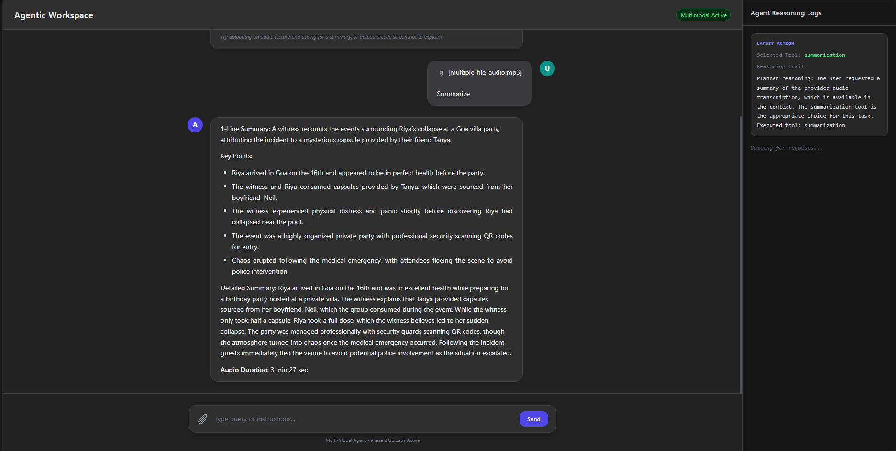
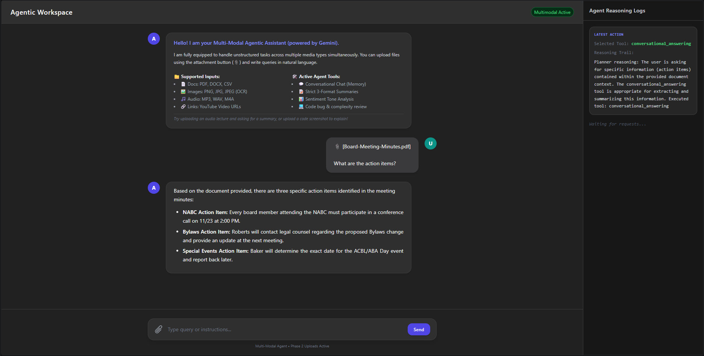
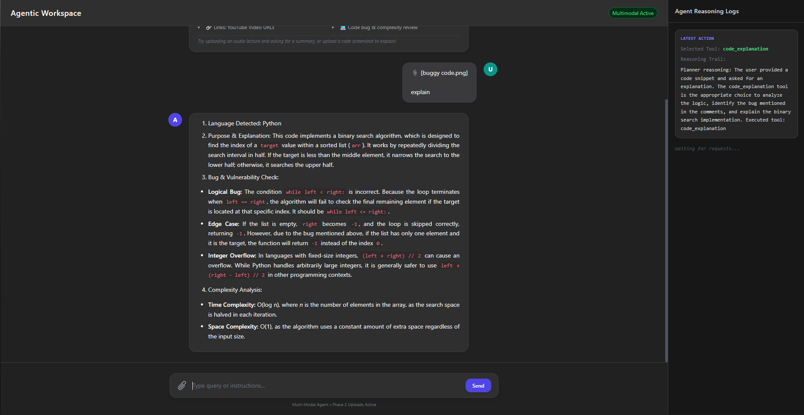
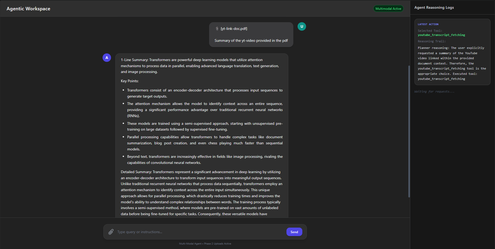
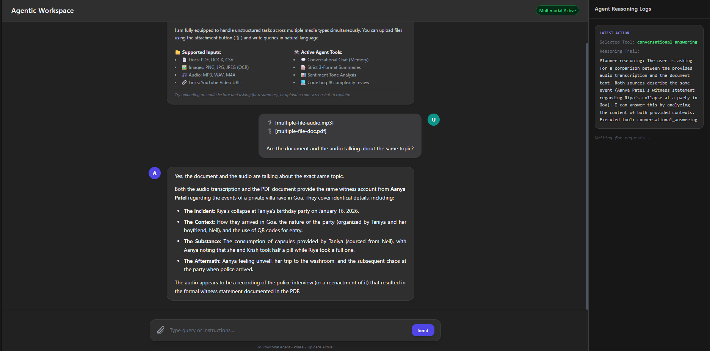
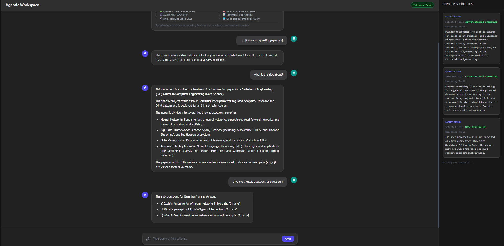
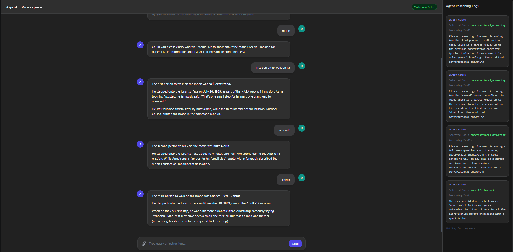
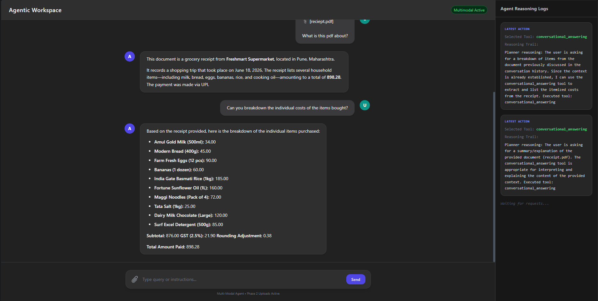
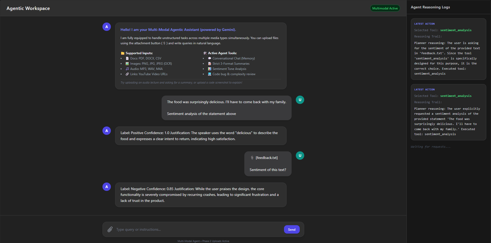

# Multi-Modal Agentic Workspace

A production-grade, agentic web application designed to analyze unstructured inputs (Text, Documents, Images, Audio, and YouTube URLs), orchestrate task-specific tools, manage stateful session memory across turns, and execute complex multi-step reasoning chains.

This system is built with **FastAPI** for the backend engine and integrates with Google’s official **`google-genai` SDK** (configured for `gemini-3.1-flash-lite`).

### 🌐 Live Deployment URL: [https://mm-agent.onrender.com](https://mm-agent.onrender.com)

> ⚠️ **Notice on Render Free Tier "Cold Start"**: Because this application is hosted on Render's Free Tier, the container automatically goes to sleep after 15 minutes of inactivity. When clicking the live link, **please allow 30–50 seconds for the server to wake up and spin up the container**. Once awake, all interactions and file analyses will respond instantly.

---

## 1. Project Directory Structure

```text
MM-Agent/
├── app/
│   ├── config.py           # Configuration and environment variable loaders
│   ├── main.py             # FastAPI multipart form endpoints, session store, & static UI routes
│   ├── agent/
│   │   ├── planner.py      # Conversation-aware intent evaluation & safeguard loop
│   │   └── executor.py     # Context-aware unified payload execution engine
│   ├── templates/
│   │   └── index.html      # Responsive ChatGPT-style HTML5/JS frontend UI
│   ├── utils/
│   │   ├── extractor.py    # Robust text & table extractor (PDF, DOCX, CSV, TXT, Images, Audio)
│   │   └── retry.py        # Exponential backoff auto-retry wrapper (Robustness)
│   └── tools/
│       ├── base.py         # Abstract base class definitions
│       ├── registry.py     # Central self-initializing tool registry singleton
│       └── text_tools.py   # Context-aware text tools (Conversational, Summarize, Sentiment, Code, YouTube)
├── assets/                 # Folder containing output demo screenshots
├── .env                    # Environment variables (ignored by Git)
├── .env.example            # Environment variables placeholder template
├── .gitignore              # Git ignore rules
├── requirements.txt        # Backend dependencies
└── README.md               # System documentation
```

---

## 2. Installed Core Tools

1. **Conversational Answering (`conversational_answering`)**
   - *Context-Aware*: Receives conversation history and active document contexts to handle follow-up queries naturally in English.
2. **Summarization (`summarization`)**
   - *Strict Format*: Outputs exactly a 1-line summary, 3 bullet points, and a 5-sentence paragraph. Appends audio duration metadata at the end of the summary if present in the context.
3. **Sentiment Analysis (`sentiment_analysis`)**
   - *Output*: Provides a sentiment classification label, confidence score, and one-line justification in English.
4. **Code Explanation (`code_explanation`)**
   - *Output*: Identifies syntax, explains functionality, checks for vulnerabilities, and outlines Big O complexity in English.
5. **YouTube Transcript Fetching (`youtube_transcript_fetching`)**
   - *Autonomous*: Downloads captions on explicit request, and programmatically chains execution to the `SummarizeTool` to output standard summaries.

---

## 3. Environment Configuration & API Keys

To protect private credentials, the `.env` file containing secrets is excluded from this repository. To run this application, you must provide your own Gemini API Key.

### Method A: Using the `.env` File (Recommended for Local Run)

1. Locate the template file named `.env.example` in the root directory.
2. Copy and rename it to `.env`:
   - **Windows (PowerShell)**: `Copy-Item .env.example .env`
   - **macOS / Linux**: `cp .env.example .env`
3. Open `.env` in a text editor and replace `your_gemini_api_key_here` with your actual Google AI Studio API key:
   ```env
   GEMINI_API_KEY=AIzaSy...yourkeyhere...
   GEMINI_MODEL=gemini-3.1-flash-lite
   ```

### Method B: Injecting Keys into Docker at Runtime

If you are running the Docker container directly without creating a `.env` file, you can inject your API key on the command line during launch:

```bash
docker run -p 8000:8000 -e GEMINI_API_KEY="your_actual_api_key" -e GEMINI_MODEL="gemini-3.1-flash-lite" your_docker_image_name
```

### Method C: Cloud Deployment Config (Render / AWS / GCP)

When deploying to a public cloud target (like Render or AWS App Runner), do not commit your `.env` file. Instead:
1. Navigate to your cloud platform's **Environment Variables** dashboard.
2. Define the following key-value pairs:
   - **Key**: `GEMINI_API_KEY` | **Value**: `[Your Gemini API Key]`
   - **Key**: `GEMINI_MODEL` | **Value**: `gemini-3.1-flash-lite`

---

## 4. Running the Application

### Running Locally
To start the server locally:
```bash
uvicorn app.main:app --reload
```
Once Uvicorn compiles, you will see a prominent, clickable link banner in your terminal. Hold `Ctrl` (or `Cmd` on macOS) and click the link to open the interface at `http://127.0.0.1:8000`.

### Running via Docker Compose (Recommended for Graders)
This application is fully Dockerized for reproducible deployment. To build and run the entire stack inside a secure, containerized environment:

1. **Build and start the container**:
   ```bash
   docker compose up --build -d
   ```
2. **Access the application**: Open your browser and navigate to `http://127.0.0.1:8000`.
3. **Stop the container**:
   ```bash
   docker compose down
   ```

---

## 5. Verification Scenarios & Test Cases

Verify your installation using the core scenarios defined in the guidelines:

### Test Case 1: Audio Transcription + Summary
- **Input**: Upload an `.mp3`, `.wav`, or `.m4a` file.
- **Query**: `"Summarize"`
- **Output**: The transcript is logged, and the summarization tool generates a structured summary with the precise calculated audio duration appended at the very end.



---

### Test Case 2: PDF + Natural Language Query (Action Items)
- **Input**: Upload `Board-Meeting-Minutes.pdf`.
- **Query**: `"What are the action items?"`
- **Output**: The planner bypasses the summary tool and routes directly to the conversational answering tool to extract and output **only** the list of action items.



---

### Test Case 3: Image with Code (OCR + Explanation)
- **Input**: Upload a screenshot of a code snippet (`code_snippet.png`).
- **Query**: `"Explain"`
- **Output**: The vision OCR extracts the text, detects Python, and outputs the detailed logic explanation, bug/vulnerability warnings, and time/space complexity.



---

### Test Case 4: Cross-Input Multi-Tool Chain (PDF with YouTube URL)
- **Input**: Upload a PDF containing a YouTube link.
- **Query**: `"Hit the YT URL in this PDF and give me a summary of it."`
- **Output**: The agent parses the PDF, extracts the YouTube URL, downloads the transcript via the YouTube tool, and programmatically dispatches the `SummarizeTool` to generate the strict 3-part summary.
- **Rate Limit Fallback**: If running in a cloud hosting environment (like Render), YouTube may block automated scraper requests. The tool catches this gracefully and returns a clean fallback block instructing how to run the transcription manually.



---

### Test Case 5: Multi-File Unified Query (Audio + PDF Comparison)
- **Input**: Upload an audio file and a PDF resume.
- **Query**: `"Do the audio and the document discuss the same topic? Reply in English"`
- **Output**: The agent transcribes the audio, extracts the PDF text, compares their semantic themes, and writes a detailed comparative analysis in English.



---

### Test Case 6: Mandatory Follow-Up Question (Ambiguity Handling)
- **Input**: Upload a document file with **no text query** in the box.
- **Output**: The programmatic check intercepts the request. The agent immediately outputs the mandatory follow-up question asking what you would like to do with the extracted content.
- **Follow-up**: Type *"what is this doc about?"* (without uploading the file again). The server automatically reuses the PDF text from its backend session store. The planner routes the overview request to `conversational_answering`, and the agent provides a clear explanation of your document.




---

### Test Case 7: Image/PDF Text Extraction with OCR Confidence (Conversational Receipt Parsing)
- **Input**: Upload an image receipt.
- **Query**: `"Can you breakdown the individual costs of the items bought?"`
- **Output**: The agent transcribes the text, calculates calculations, and outputs a complete itemized receipt breakdown.



---

### Test Case 8: Sentiment Analysis
- **Input**: Upload `feedback.txt`.
- **Query**: `"Analyze the sentiment of this feedback."`
- **Output**: The agent reads the text content and outputs the Sentiment Label, Confidence Score, and One-Line Justification in English.

